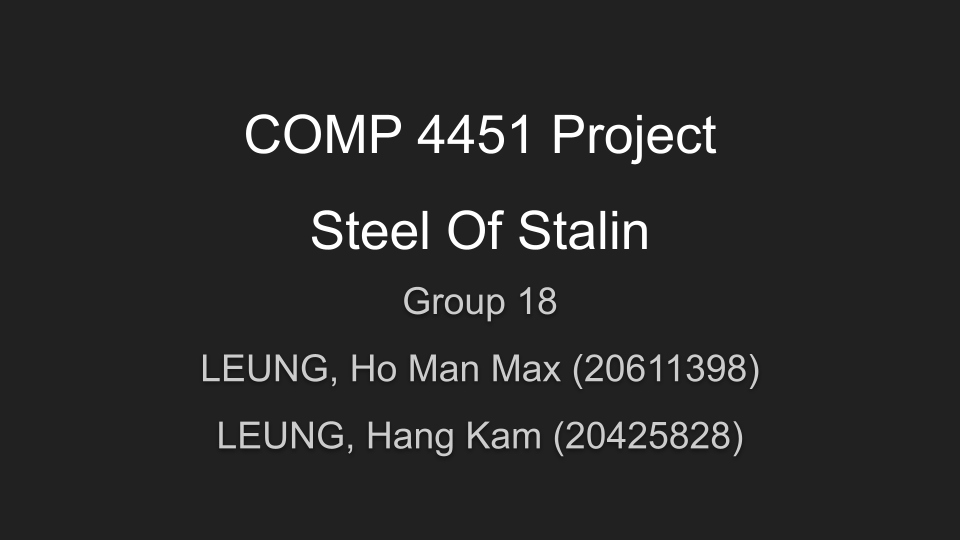

# COMP4451



[](https://yarnpkg.com/)
[](https://nodejs.org/en/)
[](https://sass-lang.com/)
[](https://momentjs.com/)

Thanks to [Max](https://github.com/Maximilianabc) for the successful delivery of this project.

---

## Project Description

Most logic is sitting in the [source](src/) folder, and the game map generation engine is made available in an [util](game_jsons_and_map_generations_utils/) folder. Feel free to check them out!

---

## Kickstart The Project

1. Make sure `Node` and `Yarn` are installed on your environment
2. Clone the project
3. Install project dependencies
```sh
$ cd /path/to/your/project
$ yarn
```
4. Start the local server. By default the url is http://localhost:3000
```sh
$ yarn start
```

---


## Documents

Details about this project can be found in our documents delivery in various phases.
* [Proposal slides](documents/proposal_slides.pdf)
* [Proposal report](documents/proposal_report.pdf)
* [Final slides](documents/final_slides.pdf)
* [Final report](documents/final_report.pdf)
