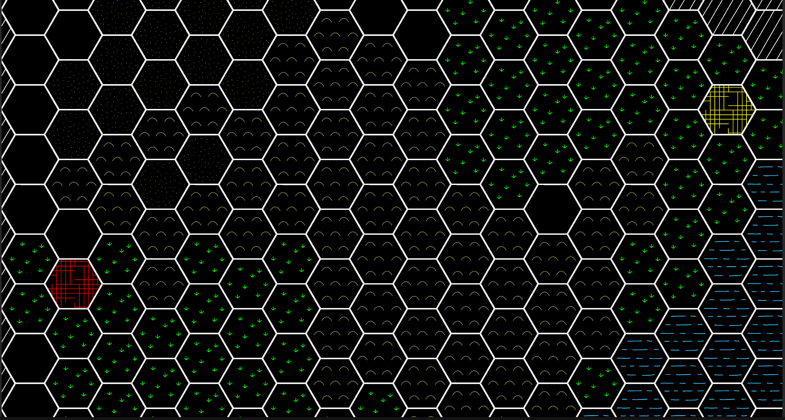

<!--  -->

# COMP4511 Game Proposal
# Steel of Stalin (Group 18)
### By LEUNG Hang Kam, Jimmy (hkleungai)
### By LEUNG Ho Man, Max (hmmleung)

---

## **Outline**
- Introduction
- Inspiration
- Gameplay
- Implementations
- Quick Demonstations
${}$
${}$
${}$
${}$
${}$
${}$

---

## **Introduction**
- Name $-$ Steel of Stalin
- Category $-$ Turn-based, "Multi-player", Strategic
- Visual characteristics $-$ Abstract 2D game map with a top-down view
- Goal $-$ Manipulating game _units_ on a designated map for destorying enemy's capital $!!$
- Target at anyone who equipped with,
  - Balanced tatics on when facing multiple game options
  - Ability to adapt to opponents' moves
${}$
${}$
${}$
${}$

---

## **Inspiration**
- Some old strategic board games are good $!!$
- *Advanced daisenryaku: Deutsch Dengeki Sakusen*, made in 1991 by Saga
  - Customizable, hexagonal-tiled map
  - Deployment planning on troops and weapons
- *Diplomacy*, made in 1954 by Allan B. Calhamer
  - Simultaneous turn-based mechanism
  - Collision handling on troop movement
- Our objectives are greatly inspired by them
  - Incoporate the above into one game
  - More extensions $-$ weapons' customization, more metrics, AI-player
${}$

---

## **Gameplay**
- Due to time limit, multi-player, negotiation-based $\rightarrow$ human-to-AI, competition-based
- Hence, at each turn,
  - Human and AI players make decisions *simultaneously*
  - All investment / deployment / movement are then fired by the program *at the same time*
- Human-player shall do more than merely deploy troops in order to win the game
  - Construct, defend the "research facilites" that supplies the resources
  - Study and exploit the geography of the map
- Human-player make decisions, so should the AI-player
  - $10\%$ luck $+$ $30\%$ strategy $+$ $0\%$ "diplomacy" $+$ $20\%$ management $+$ $40\%$ control
  - Luck on computed probabilistic bias, with the rest on enemy's historical moves
- Can greedy works? **NO** $!!$ Units counter each other, and probability gives unpredictability.

---

## **Implementations**
- ThreeJS + WebGL as base framework
  - Material layout with light effect
  - Javascript $-$ Possibility for extending into a web framework-based application
- Several programming challenges that have to be overcome
  - AI-player design
    - It should be an unpredictable, fair player to the human
    - Hence need keep monitoring and evaluating game units, so that metrics can be computed and applied to the AI-player.
  - Game map and units design
    - They have to be trivial and visually appealing at the same time
    - Hence requires thinking on grid arrangement and construction, and on design of game units

---

## **Quick Demonstations**
- Below is a preliminary hexagonal grid, with many details to be filled.

---

# The End
